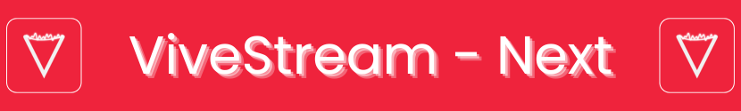

<div align="center">



<br/>

[](https://tauri.app/)
[](https://solidjs.com/)
[](https://www.rust-lang.org/)
[](./LICENSE)
[](<>)

### 🎬 A lightning-fast, native YouTube downloader & sleek local media library.

Built with **Tauri v2**, **SolidJS**, and **Rust** for maximum performance, hardware-accelerated transcoding, and a tactile claymorphic interface.

[Download Latest Release](https://github.com/rootlocalghost/ViveStream-Next/releases) • [Features](#-core-features) • [Keyboard Shortcuts](#-keyboard-shortcuts) • [Developer Guide](#-developer-setup) • [Documentation](./docs/vivestream-next/)

</div>

---

## ✨ Project Overview & Tech Stack

ViveStream-Next is an advanced, ultra-lightweight, offline-first media downloader and local streaming platform. Unlike Electron-based alternatives, it avoids shipping a bundled Chromium browser, keeping the install size incredibly small.

### The Stack

- **Frontend:** SolidJS for extreme performance and a zero-Virtual-DOM experience.
- **Backend:** Tauri v2 powered by Rust for native OS integration and performance.
- **Engines:** `yt-dlp` (Media Extraction), `FFmpeg` (Transcoding/Merging), and `Deno` (Cryptographic JS evaluation).
- **Database:** SQLite (via `rusqlite` & `tauri-plugin-sql`) for fast, local metadata indexing.
- **Local Server:** A dedicated `warp` HTTP server routes local media seamlessly to the video player.

---

## ✨ Key Features

### 🚀 High-Performance Engine

- **Smart Hardware Transcoding**: Automatic hardware-accelerated transcoding via NVIDIA NVENC, Intel QSV, AMD AMF, and Linux VAAPI (with smooth CPU fallback).
- **Multi-Fragment Downloads**: Parallel fragment fetching for blazing-fast HLS/DASH downloads.
- **Concurrent Queue Management**: Configurable parallel download slots (1–5 simultaneous jobs) with real-time progress logging and status tracking.
- **Advanced Extraction**: Utilizes a headless native WebView to seamlessly extract Proof of Origin (PO) tokens, and `Deno` for decrypting YouTube's JS obfuscation.
- **Browser Cookie Integration**: Automatic cookie extraction from 8+ desktop browsers (Chrome, Firefox, Brave, Edge, Opera, Vivaldi, Chromium, Safari) for restricted or premium media.
- **Zero-Config Setup Wizard**: Automated initial provisioning and integrity verification for `yt-dlp` and `ffmpeg` binaries (downloaded on-the-fly to reduce installer bloat).

### 📚 Media Library, Playlists & Artists

- **Automated Playlist Ingestion**: Paste any YouTube playlist URL to automatically create the playlist locally, download the media, deduplicate existing files, and link them.
- **Custom Playlists**: Create, reorder, rename, and manage playlists with one-click "Play All" queueing.
- **Artist & Channel Hub**: Automatically organizes media by artist/channel with avatar caching, subscriber badges, and dedicated channel catalogs.
- **Interactive Favourites**: Instant one-click bookmarking across all library views.
- **Metadata Editor**: Edit video titles and channel names directly from the media library.

### 🎥 Cinema Player Experience

- **Local Streaming**: Instant playback powered by an embedded local HTTP `warp` server routing files directly from your disk to the frontend.
- **Display Modes**: Toggle between Standard View, **Theater Mode**, **Fullscreen**, and Picture-in-Picture (**Miniplayer**).
- **Custom Subtitles & Playback Speed**: Multi-track `.vtt` caption rendering and variable playback speeds (0.25x – 2.0x).
- **On-Screen Display (OSD)**: Sleek glassmorphic OSD badges providing instant visual feedback for seeking, volume, and playback modes.
- **Smart Context Queue**: Seamlessly plays next items in context of current playlist or artist.
- **Native Media Controls**: Integration with system media controls (play/pause, next/prev) via the `souvlaki` crate.

### 🎨 Claymorphism Design & Themes

- **Vibrant Themes**: Switch between **Sunset** and **Crimson** accent palettes with Dark and Light mode support.
- **Dynamic Sidebar**: Collapsible navigation with optional auto-expand on hover.
- **Toast & Modal Dialogs**: Responsive notifications and tactile confirmations.
- **100% Private & Local**: No telemetry, no tracking, no external server lock-in.

---

## ⌨️ Keyboard Shortcuts

Press <kbd>?</kbd> or <kbd>Shift</kbd> + <kbd>/</kbd> anywhere in the application to view the interactive cheat sheet:

### 🎬 Player Controls

| Shortcut                          | Action                                 |
| :-------------------------------- | :------------------------------------- |
| <kbd>Space</kbd> or <kbd>K</kbd>  | **Play / Pause**                       |
| <kbd>M</kbd>                      | **Mute / Unmute**                      |
| <kbd>F</kbd>                      | **Toggle Fullscreen**                  |
| <kbd>T</kbd>                      | **Toggle Theater Mode**                |
| <kbd>I</kbd>                      | **Toggle Miniplayer (PiP)**            |
| <kbd>←</kbd> / <kbd>→</kbd>       | **Seek Backward / Forward 5s**         |
| <kbd>J</kbd> / <kbd>L</kbd>       | **Seek Backward / Forward 10s**        |
| <kbd>↑</kbd> / <kbd>↓</kbd>       | **Volume Up / Down (5%)**              |
| <kbd>N</kbd> / <kbd>P</kbd>       | **Next / Previous Media in Queue**     |
| <kbd>C</kbd>                      | **Toggle Captions / Subtitles**        |
| <kbd>R</kbd>                      | **Toggle Repeat / Loop**               |
| <kbd>0</kbd> – <kbd>9</kbd>       | **Seek to Percentage (0% – 90%)**      |
| <kbd>&lt;</kbd> / <kbd>&gt;</kbd> | **Decrease / Increase Playback Speed** |

### 🧭 Global Navigation

| Shortcut                                        | Destination                    |
| :---------------------------------------------- | :----------------------------- |
| <kbd>Shift</kbd> + <kbd>1</kbd> or <kbd>H</kbd> | **Home**                       |
| <kbd>Shift</kbd> + <kbd>2</kbd> or <kbd>F</kbd> | **Favourites**                 |
| <kbd>Shift</kbd> + <kbd>3</kbd> or <kbd>P</kbd> | **Playlists**                  |
| <kbd>Shift</kbd> + <kbd>4</kbd> or <kbd>A</kbd> | **Artists**                    |
| <kbd>Shift</kbd> + <kbd>5</kbd> or <kbd>D</kbd> | **Downloads**                  |
| <kbd>Shift</kbd> + <kbd>6</kbd> or <kbd>S</kbd> | **Settings**                   |
| <kbd>Esc</kbd>                                  | **Go Back / Close Modals**     |
| <kbd>?</kbd>                                    | **Open Shortcuts Cheat Sheet** |

---

## 📦 Installation

### 🐧 Arch Linux / Manjaro (Recommended)

```bash
wget https://raw.githubusercontent.com/rootlocalghost/ViveStream-Next/main/PKGBUILD
makepkg -si
```

### 🪟 Windows & 🐧 Debian/Ubuntu

Download the latest pre-compiled installer (`.exe` for Windows, `.deb` for Debian/Ubuntu, or `.pkg.tar.zst` for Arch) directly from the **[Releases](https://github.com/rootlocalghost/ViveStream-Next/releases)** page.

> [!TIP]
> **Security Notice (Unknown Publisher):**
> ViveStream is a free, non-commercial open-source project. Because we do not purchase corporate code-signing certificates:
>
> - **Windows Defender SmartScreen:** Click **"More Info"** ➔ **"Run Anyway"**.
> - **Linux:** Right-click the binary ➔ **Properties** ➔ Check **"Allow executing file as program"** (or `chmod +x`).

### 🗑️ Complete App Data Wipe (Optional)

Because core engines (`yt-dlp`/`ffmpeg`) and downloaded media are stored locally at runtime:

- Before uninstalling, you can navigate to **Settings ➔ Danger Zone** and select **Nuclear Wipe** to safely delete all media files and database storage.

---

## ⚙️ Environment Variables (Linux)

To workaround WebKitGTK and Linux compositor issues, the application sets or accepts the following environment variables. You can set them before launching the application:

- `VIVESTREAM_SAFE_GRAPHICS=1`: If set to `1`, disables DMA-BUF hardware acceleration in WebKitGTK by setting `WEBKIT_DISABLE_DMABUF_RENDERER=1`. Useful if running in a virtual machine or experiencing graphical glitches.
- `WEBKIT_DISABLE_SANDBOX_THIS_IS_DANGEROUS=1`: Automatically set by the app to prevent spurious WebKitWebProcess seccomp crash traps (often seen on Arch Linux / Wayland / Hyprland).
- `WEBKIT_FORCE_COMPOSITING_MODE=1`: Automatically set to force hardware-accelerated compositor mode.
- `WEBKIT_GPU_POLICY=force`: Automatically set to force dedicated GPU rasterization.
- `GDK_FRAME_CLOCK_FPS=0`: Automatically set to uncap the GTK frame clock to match high refresh rate monitors (100Hz+).

---

## 💻 Developer Setup

### Prerequisites

- **[Bun](https://bun.sh/)** (v1.0+)
- **[Rust & Cargo](https://rustup.rs/)** (v1.80+)
- **C Build Tools & WebKitGTK** _(Linux only)_:
  ```bash
  # Debian/Ubuntu
  sudo apt-get install -y libwebkit2gtk-4.1-dev build-essential curl wget file libxdo-dev libssl-dev libayatana-appindicator3-dev librsvg2-dev

  # Arch Linux
  sudo pacman -S base-devel webkit2gtk-4.1 curl wget unzip
  ```

### Build & Run Steps

1. **Clone the repository:**

   ```bash
   git clone https://github.com/rootlocalghost/ViveStream-Next.git
   cd ViveStream-Next
   ```

2. **Initialize & Install dependencies:**

```bash
bun run init
```

_This command runs cargo build, installs JS dependencies via Bun, and builds Vite._

3. **Run in Development Mode:**

   ```bash
   bun start
   # or
   bun run tauri dev
   ```

   _Note: This will spin up the SolidJS dev server and the Rust backend. Any changes to Rust code will trigger a recompile._

4. **Run Automated Tests:**

   ```bash
   # Frontend tests (Vitest)
   bun run test

   # Backend tests (Cargo)
   cargo test --manifest-path src-tauri/Cargo.toml
   ```

5. **Build for Production:**
   ```bash
   bun run tauri build
   # or use the provided scripts for specific platforms:
   bun run build:linux
   bun run build:win
   ```

### Documentation

For deep-dives into the codebase structure, architectural decisions, database schema, build setup, and Tauri APIs, see the [`docs/vivestream-next`](./docs/vivestream-next/) folder.

---

## ⚖️ License

**PolyForm Noncommercial License 1.0.0**

This project is free to use, modify, and build upon for personal, educational, and non-commercial purposes. **You may not use this software for any commercial purpose.**

See the [`LICENSE`](./LICENSE) file for details.

_Disclaimer: This tool is intended for personal media archival and offline viewing of content you have the right to access. The developers are not responsible for how users utilize this software._
